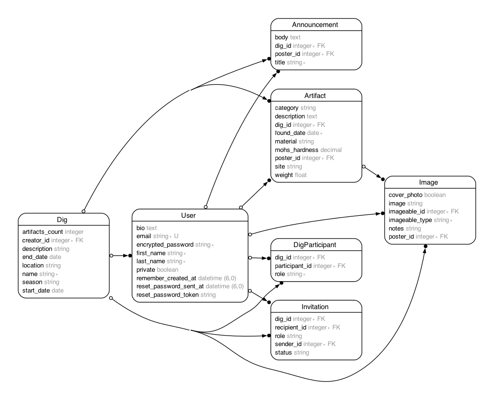

# ArchaeoLog

[`ArchaeoLog`](https://archaeolog.app) is a digital field log where archaeologists can create digs, add participants, add images, and log artifacts. It is a streamlined and user-friendly application that serves as a modern and lightweight upgrade to traditional museum and archaeological software.

## Table of Contents
1. [Features](#features)
2. [Future Features](#future-features)
3. [Data Model](#data-model)
4. [Installation](#installation)
5. [Contact](#contact)

## Features

1. Digs: Create and manage archaeological digs with details such as location, start and end date, and description. 
2. Participants: Invite participants involved in a dig and assign roles to ensure security and control access.
3. Artifacts Logging: Log artifacts discovered during digs with detailed information such as material, category, description, and images.
4.  Image Uploads: Upload images related to digs and artifacts and add notes for easy reference. Utilizes Cloudinary for cloud-based storage.
5.  Data Visualization: Uses ChartKick for visualization of artifacts by type and date found.
6.  Modularized Data: Easy navigation of information related to digs, participants, and artifacts.
7. Announcements: Keep dig participants informed with announcements related to your project.

## Future Features

1. Maps Integration: View your dig's location on a map using GeoCoding and Google Maps API.
2. More robust data charts based on additional artifact attributes
3. Email notifications for invitations, announcements, and account information
4. Ability to add custom fields for artifacts
5. PDF uploads to share academic papers

## Data Model



## Installation
1. Clone this repository:
```
  git clone https://github.com/melo616/ArchaeoLogRuby.git
  cd ArchaeoLog
```
2. Install dependencies:
  - Postgresql 12
  - Ruby version: `3.2.1`
  - Rails version: `7.0.4.3`
  - Bundler version: `2.4.6`
3. Install gems:
```
  bundle install
```
4. Set up database:
```
  rails db:create
  rails db:migrate
```
5. Setup environment variables:
   -Set up a Cloudinary account and access your cloud name, api secret, and api key
   -Create a .env with the following format:
```
 CLOUDINARY_CLOUD_NAME="your cloud name"
 CLOUDINARY_API_KEY="your api key"
 CLOUDINARY_API_SECRET="your api secret"
```

## Contact

Kat Jarboe - [LinkedIn](https://www.linkedin.com/in/katjarboe/)
